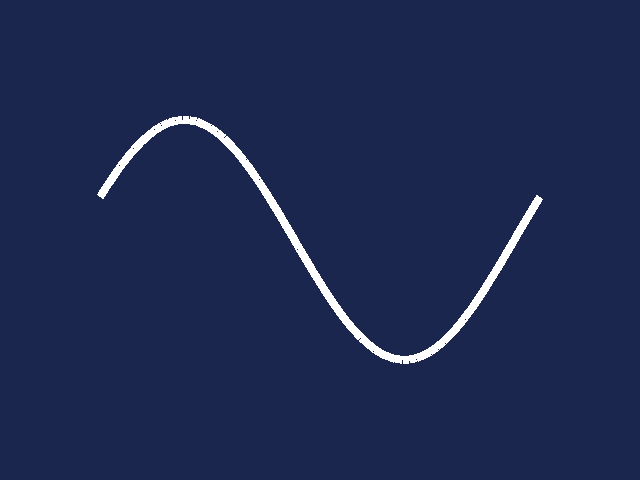
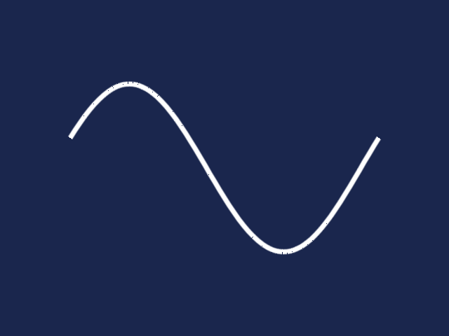

This is the standalone C / C++ build of the `Minnie` vector graphics API (distributed under terms of the [MIT license](../LICENSE)).

[main.c](main.c) contains a set of ~70 test cases for Minnie's ShaderVG render backend ([screenshots](../tkminnie/tests/screenshots/), [API docs](https://html-preview.github.io/?url=https://raw.githubusercontent.com/bsp2/tks/main/apidocs/ee/ShaderVG.html)).

See [here](../tkminnie/README.md) for `TKS` language bindings and script version of the test cases.

# Prerequisites
- Clang compiler
- SDL2 (install via `% brew install sdl2`)

# Build instructions for macOS:
- `% . ./setenv_macos.sh`
- `% cd minnie/native/build/macos/`
- `m clean ; m bin`

# Running the test:
- `./minnie_test`

# Keyboard controls:
- `ESCAPE` exit
- `UP` select next test
- `DOWN` select previous test
- `SPACE` toggle animation
- `lctrl - SPACE` toggle slow-motion
- `RETURN` reset rotation
- `LEFT` decrease stroke width
- `RIGHT` increase stroke width
- `a` toggle anti-aliasing
- `d` toggle debug mode
- `l` toggle symmetry-lock (rounded rectangles, ellipses, ..)
- `r` decrease alpha
- `lctrl - r` decrease decal alpha
- `t` increase alpha
- `lctrl - t` increase decal alpha

# Screenshots
- test_000_rect_fill_aa
  
  
- test_001_rect_fill_stroke_aa
  
  
- test_002_rect_stroke_aa
  
  
- test_003_ellipse_fill_aa
  
  
- test_004_ellipse_fill_stroke_aa
  
  
- test_005_ellipse_stroke_aa
  
  
- test_006_roundrect_fill_aa
  
  
- test_007_roundrect_fill_stroke_aa
  
  
- test_008_roundrect_stroke_aa
  
  
- test_009_triangles_tex_uv_flat
  
  
- test_010_triangles_tex_uv_gouraud
  
  
- test_011_triangles_tex_uv_flat_decal
  
  
- test_012_triangles_tex_uv_gouraud_decal
  
  
- test_013_line_strip_flat_1
  
  
- test_014_line_strip_flat_2
  
  
- test_015_line_strip_flat_aa_1
  
  
- test_016_line_strip_flat_aa_2
  
  
- test_017_line_strip_flat_bevel
  
  
- test_018_line_strip_flat_bevel_aa
  
  
- test_019_custom_shader_1
  
  
- test_020_custom_shader_2
  
  
- test_021_custom_shader_3(vbo)
  
  .png)
- test_022_lines
  
  
- test_023_lines_aa
  
  
- test_024_begin_line_strip
  
  
- test_025_begin_line_strip_aa
  
  
- test_026_begin_line_strip_bevel
  
  
- test_027_begin_line_strip_bevel_aa
  
  
- test_028_begin_lines
  
  
- test_029_begin_lines_aa
  
  
- test_030_draw_filled_rectangle
  
  
- test_031_begin_points_square
  
  
- test_032_begin_points_square_aa
  
  
- test_033_begin_points_round
  
  
- test_034_begin_points_round_aa
  
  
- test_035_begin_filled_triangles
  
  
- test_036_begin_filled_triangle_fan
  
  
- test_037_begin_filled_triangle_strip
  
  
- test_038_begin_filled_gouraud_triangles
  
  
- test_039_begin_filled_gouraud_triangle_fan
  
  
- test_040_begin_filled_gouraud_triangle_strip
  
  
- test_041_begin_textured_triangles
  
  
- test_042_begin_textured_triangles_alpha
  
  
- test_043_begin_textured_triangle_fan
  
  
- test_044_begin_textured_triangle_fan_alpha
  
  
- test_045_begin_textured_triangle_strip
  
  
- test_046_begin_textured_triangle_strip_alpha
  
  
- test_047_begin_textured_gouraud_triangles
  
  
- test_048_begin_textured_gouraud_triangles_alpha
  
  
- test_049_begin_textured_gouraud_triangle_fan
  
  
- test_050_begin_textured_gouraud_triangle_fan_alpha.png
  
  
- test_051_begin_textured_gouraud_triangle_strip
  
  
- test_052_begin_textured_gouraud_triangle_strip_alpha.png
  
  
- test_053_text_1
  
  
- test_054_text_2_clip
  
  
- test_055_text_3_swirl
  
  
- test_056_text_4_ul
  
  
- test_057_text_5_ul_clip
  
  
- test_058_text_6_accel
  
  
- test_059_text_7_accel_clip
  
  
- test_060_text_8_zoom
  
  
- test_061_text_9_zoom_sdf
  
  
- test_062_gradient_to_texture
  
  
- test_063_triangles_gradient_linear
  
  
- test_064_triangles_gradient_radial
  
  
- test_065_triangles_gradient_conic
  
  
- test_066_polygon_vbo
  
  
- test_067_polygon_aa_vbo
  
  
- test_068_begin_polygon
  
  
- test_069_begin_polygon_aa
  
  
- test_070_polygon_gradient_linear
  
  
- test_071_polygon_gradient_linear_aa
  
  
- test_072_polygon_gradient_radial
  
  
- test_073_polygon_gradient_radial_aa
  
  
- test_074_polygon_gradient_conic
  
  
- test_075_polygon_gradient_conic_aa
  
  
